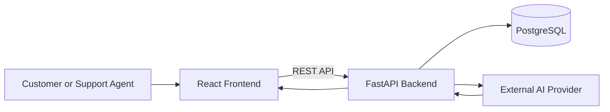

# AI-Powered Support Ticket Assistant

An AI-integrated customer-support ticket management application built with FastAPI, React.js, PostgreSQL, and an external AI provider.

The system helps support agents analyze customer tickets by generating:

* ticket category
* ticket priority
* concise ticket summary
* recommended support team
* suggested customer response

All AI-generated output is reviewed by a human support agent before use.

---

## Project Status

**Current Phase:** Repository and engineering setup
**Application Status:** Pre-implementation
**Documentation Status:** Initial documentation completed
**Version:** `0.1.0`

---

## Problem Overview

Customer-support agents spend significant time manually:

* reading ticket descriptions
* identifying issue categories
* assigning ticket priorities
* routing tickets to the correct support team
* creating internal summaries
* drafting customer responses

This process can be repetitive, slow, and inconsistent.

The AI-Powered Support Ticket Assistant aims to reduce repetitive effort by generating structured recommendations while keeping support agents responsible for final decisions.

---

## Project Goals

The project is designed to provide practical experience with:

* Python
* FastAPI
* REST API design
* PostgreSQL
* SQLAlchemy
* Pydantic validation
* React.js
* AI API integration
* structured AI output
* exception handling
* logging
* automated testing
* Docker
* GitHub Actions
* system design
* software documentation
* secure AI engineering

---

## Core Features

### Ticket Management

* create support tickets
* retrieve a ticket by ID
* list support tickets
* update ticket details
* update ticket status
* filter tickets
* paginate ticket results
* close tickets without permanent deletion

### AI Ticket Analysis

* classify ticket category
* recommend ticket priority
* generate a short issue summary
* recommend the correct support team
* generate a suggested customer response
* validate AI-generated structured output
* retry failed analysis
* regenerate analysis when requested

### Human Review

* review AI-generated category
* correct AI-generated priority
* modify recommended support team
* edit AI-generated summary
* edit suggested response
* reject unsuitable AI output

### Engineering Features

* layered backend architecture
* environment-based configuration
* structured error responses
* health and readiness checks
* database migrations
* automated tests
* linting
* Docker Compose
* CI workflows
* architecture documentation

---

## Human-in-the-Loop Principle

The system follows a human-in-the-loop AI approach.

AI-generated information is treated as a recommendation.

The AI will not automatically:

* send customer responses
* close tickets
* process refunds
* change customer accounts
* perform payment actions
* make irreversible business decisions

A support agent remains responsible for reviewing and approving generated content.

---

## Technology Stack

| Area                | Technology                 |
| ------------------- | -------------------------- |
| Backend Language    | Python                     |
| Backend Framework   | FastAPI                    |
| ASGI Server         | Uvicorn                    |
| Database            | PostgreSQL                 |
| ORM                 | SQLAlchemy                 |
| Validation          | Pydantic                   |
| Database Migrations | Alembic                    |
| Frontend            | React.js                   |
| Frontend Build Tool | Vite                       |
| AI Integration      | External AI provider       |
| Backend Testing     | Pytest                     |
| API Documentation   | OpenAPI, Swagger UI, ReDoc |
| Containerization    | Docker                     |
| Local Orchestration | Docker Compose             |
| CI                  | GitHub Actions             |
| Version Control     | Git                        |
| Repository Hosting  | GitHub                     |

The specific AI provider and model will be finalized in a separate Architecture Decision Record.

---

## High-Level Architecture



The frontend communicates only with the FastAPI backend.

The frontend does not directly access:

* PostgreSQL
* AI-provider credentials
* the AI-provider API
* backend secrets

---

## Primary Workflow

```text
Customer submits ticket
        ↓
FastAPI validates request
        ↓
Ticket is stored in PostgreSQL
        ↓
Support agent requests AI analysis
        ↓
Backend sends required ticket content to AI provider
        ↓
AI returns structured recommendations
        ↓
Backend validates AI output
        ↓
Validated output is stored
        ↓
Support agent reviews and corrects suggestions
```

---

## Ticket Categories

The initial supported categories are:

* `PAYMENT`
* `DELIVERY`
* `ACCOUNT`
* `REFUND`
* `TECHNICAL`
* `OTHER`

---

## Ticket Priorities

The initial supported priorities are:

* `LOW`
* `MEDIUM`
* `HIGH`
* `CRITICAL`

---

## Ticket Statuses

The initial ticket lifecycle uses:

* `OPEN`
* `IN_PROGRESS`
* `RESOLVED`
* `CLOSED`

The initial lifecycle is:

```text
OPEN
  ↓
IN_PROGRESS
  ↓
RESOLVED
  ↓
CLOSED
```

A resolved ticket may return to `IN_PROGRESS` if the issue continues.

---

## AI Analysis Statuses

The planned AI-analysis statuses are:

* `NOT_REQUESTED`
* `IN_PROGRESS`
* `COMPLETED`
* `FAILED`
* `INVALID_OUTPUT`

---

## Planned Project Structure

```text
ai-powered-support-ticket-assistant/
├── .github/
│   ├── workflows/
│   ├── ISSUE_TEMPLATE/
│   └── pull_request_template.md
│
├── docs/
│   ├── adr/
│   ├── README.md
│   ├── PROBLEM_DEFINITION.md
│   ├── REQUIREMENTS.md
│   ├── HLD.md
│   ├── LLD.md
│   ├── API_SPEC.md
│   ├── TESTING.md
│   ├── SECURITY.md
│   ├── SETUP.md
│   └── DEPLOYMENT.md
│
├── src/
│   ├── backend/
│   └── frontend/
│
├── tests/
├── .env.example
├── .gitignore
├── docker-compose.yml
├── Makefile
├── LICENSE
└── README.md
```

The backend and frontend internal structures will be added during implementation.

---

## Documentation

Complete project documentation is available in the [`docs/`](docs/) directory.

Recommended reading order:

1. [Problem Definition](docs/PROBLEM_DEFINITION.md)
2. [Requirements](docs/REQUIREMENTS.md)
3. [High-Level Design](docs/HLD.md)
4. [Low-Level Design](docs/LLD.md)
5. [API Specification](docs/API_SPEC.md)
6. [Architecture Decision Records](docs/adr/README.md)
7. [Testing Strategy](docs/TESTING.md)
8. [Security Guidelines](docs/SECURITY.md)
9. [Development Setup](docs/SETUP.md)
10. [Deployment Guide](docs/DEPLOYMENT.md)

---

## Architecture Decision Records

The project currently contains the following accepted ADRs:

| ADR     | Decision                                            |
| ------- | --------------------------------------------------- |
| ADR-001 | Use FastAPI as the backend framework                |
| ADR-002 | Use PostgreSQL as the primary database              |
| ADR-003 | Use SQLAlchemy for database access                  |
| ADR-004 | Use a layered backend architecture                  |
| ADR-005 | Use one external AI provider through an abstraction |
| ADR-006 | Require human review for AI-generated output        |
| ADR-007 | Use Docker Compose for local development            |
| ADR-008 | Use React.js for the frontend                       |

See [`docs/adr/README.md`](docs/adr/README.md) for details.

---

## Planned API Groups

### Operational APIs

* health check
* readiness check

### Ticket APIs

* create ticket
* retrieve ticket
* list tickets
* update ticket
* update ticket status
* close ticket

### AI APIs

* request ticket analysis
* retrieve ticket analysis
* regenerate ticket analysis
* correct AI-generated values

Detailed contracts are documented in [`docs/API_SPEC.md`](docs/API_SPEC.md).

---

## MVP Scope

The first version will include:

* ticket CRUD operations
* ticket filtering
* ticket pagination
* ticket status management
* PostgreSQL persistence
* AI ticket classification
* AI priority recommendation
* AI summary generation
* AI support-team recommendation
* AI suggested-response generation
* human correction of AI results
* health and readiness endpoints
* tests
* Docker Compose
* GitHub Actions

---

## Out of Scope for MVP

The following features are intentionally excluded from the first version:

* customer authentication
* support-agent authentication
* role-based access control
* automatic email sending
* chatbot interface
* voice support
* file attachments
* payment processing
* Redis
* Kafka
* background workers
* vector database
* Retrieval-Augmented Generation
* multiple AI providers
* Kubernetes
* advanced analytics
* multilingual processing
* production-scale infrastructure

These may be considered after the MVP is stable.

---

## Development Approach

The project will be implemented incrementally.

### Phase 0 — Documentation

* problem definition
* requirements
* HLD
* LLD
* API specification
* ADRs
* testing strategy
* security guidelines
* setup guide
* deployment guide

### Phase 1 — Repository Foundation

* repository structure
* environment templates
* Git ignore rules
* Makefile
* GitHub templates
* CI workflow setup
* branch protection
* initial commits
* `develop` branch

### Phase 2 — Backend Foundation

* FastAPI application
* health endpoint
* readiness endpoint
* configuration management
* PostgreSQL connection
* SQLAlchemy setup
* Alembic setup
* exception handling
* logging

### Phase 3 — Ticket Management

* ticket creation
* ticket retrieval
* ticket listing
* ticket updates
* status lifecycle
* filtering
* pagination

### Phase 4 — AI Integration

* AI-provider client
* ticket-analysis prompt
* structured AI output
* output validation
* timeout handling
* provider error handling
* response suggestions
* human corrections

### Phase 5 — Frontend

* React project setup
* ticket form
* ticket list
* ticket details
* AI-analysis panel
* status updates
* error handling

### Phase 6 — Quality and Delivery

* unit tests
* integration tests
* frontend tests
* Dockerfiles
* Docker Compose
* CI workflows
* deployment verification

---

## Development Rules

The project follows these engineering rules:

* routes should not contain database queries
* routes should not call the AI provider directly
* business rules belong in the service layer
* database operations belong in repositories
* API schemas remain separate from database models
* AI output is always validated
* AI-generated responses remain drafts
* secrets are stored outside source code
* tests use synthetic data
* documentation must be updated when behaviour changes
* Redis, Kafka, and other infrastructure require a real use case before being introduced

---

## Security Notice

The MVP does not include authentication or authorization.

Therefore:

* use synthetic ticket data only
* do not enter real customer information
* do not expose the application publicly
* do not use production credentials
* do not commit local `.env` files
* do not place AI keys in the React frontend

Read [`docs/SECURITY.md`](docs/SECURITY.md) before implementation.

---

## Local Development

Detailed setup instructions are available in:

[`docs/SETUP.md`](docs/SETUP.md)

The planned local services are:

| Service         | Default Port |
| --------------- | -----------: |
| React Frontend  |       `3000` |
| FastAPI Backend |       `8000` |
| PostgreSQL      |       `5432` |

The planned backend development documentation will be available at:

* `/docs`
* `/redoc`
* `/openapi.json`

---

## Testing

The project will use:

* backend unit tests
* service-layer tests
* repository integration tests
* API integration tests
* mocked AI-provider tests
* frontend component tests
* frontend integration tests
* end-to-end smoke tests

The live AI provider will not be required for normal CI execution.

See [`docs/TESTING.md`](docs/TESTING.md).

---

## CI/CD

The initial project will include Continuous Integration for:

* backend tests
* backend linting
* frontend linting
* frontend tests
* frontend production build
* database migration verification

Automated production deployment is outside the initial MVP.

---

## Branch Strategy

The planned branch model is:

| Branch      | Purpose                           |
| ----------- | --------------------------------- |
| `main`      | Stable and release-ready code     |
| `develop`   | Integrated development            |
| `feature/*` | Individual features               |
| `bugfix/*`  | Defect fixes                      |
| `docs/*`    | Documentation changes when needed |

Feature work should normally branch from `develop`.

---

## Commit Convention

Recommended commit prefixes:

* `docs:` documentation changes
* `feat:` new feature
* `fix:` bug fix
* `test:` test changes
* `refactor:` internal code improvement
* `chore:` tooling or maintenance
* `ci:` CI workflow change
* `build:` dependency or build-system change
* `security:` security-related change

Example:

```text
docs: add high-level design
```

---

## Current Progress

### Documentation

* [x] Problem definition
* [x] Requirements
* [x] High-Level Design
* [x] Low-Level Design
* [x] API specification
* [x] Architecture Decision Records
* [x] Testing strategy
* [x] Security guidelines
* [x] Setup guide
* [x] Deployment guide
* [x] Documentation index

### Repository Foundation

* [ ] Root README
* [ ] Repository directories
* [ ] `.gitignore`
* [ ] `.env.example`
* [ ] Makefile
* [ ] Pull-request template
* [ ] CI workflows
* [ ] Initial documentation commit
* [ ] `develop` branch
* [ ] Branch protection

### Application

* [ ] Backend setup
* [ ] Frontend setup
* [ ] Database setup
* [ ] Docker setup
* [ ] Ticket APIs
* [ ] AI integration
* [ ] Automated tests
* [ ] Deployment

After adding this file, mark **Root README** as completed.

---

## Success Criteria

The MVP will be considered successful when:

* tickets can be created and stored
* tickets can be retrieved and updated
* ticket lists support pagination and filtering
* ticket status transitions follow business rules
* AI analysis returns structured recommendations
* invalid AI output is rejected
* AI failures do not break ticket management
* agents can correct AI-generated values
* automated tests pass
* Docker Compose starts the application
* health and readiness checks succeed
* another developer can run the project using the documentation

---

## License

A project license will be added before public distribution.

Until then, repository usage and contribution terms are not formally defined.

---

## Author

**Raja Rangarao Moturi**

Backend Engineer focused on:

* Java and Spring Boot
* Python and FastAPI
* PostgreSQL
* AWS
* AI-integrated backend systems
* scalable and maintainable software design
