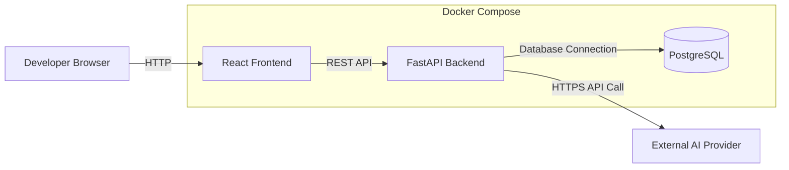
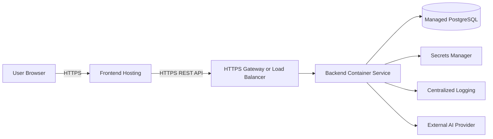

# AI-Powered Support Ticket Assistant

## Deployment Guide

---

## 1. Document Information

| Field           | Value                               |
| --------------- | ----------------------------------- |
| Project Name    | AI-Powered Support Ticket Assistant |
| Document Type   | Deployment Guide                    |
| Document Status | Draft                               |
| Version         | 1.0                                 |
| Author          | Raja Rangarao Moturi                |
| Last Updated    | 2026-07-26                          |

---

## 2. Purpose

This document defines how the AI-Powered Support Ticket Assistant will be packaged, configured, deployed, verified, monitored, and rolled back.

It covers:

* deployment environments
* deployment architecture
* container deployment
* environment configuration
* database migrations
* frontend deployment
* backend deployment
* AI-provider configuration
* health and readiness checks
* release process
* rollback strategy
* production security requirements
* post-deployment verification
* troubleshooting

The MVP will focus primarily on local and development deployment. Production deployment details will be refined when a cloud platform is selected.

---

## 3. Deployment Objectives

The deployment process should provide:

* repeatable builds
* environment-specific configuration
* safe secret handling
* reliable database migration
* service health verification
* clear rollback procedures
* separation between development and production
* minimal manual configuration
* traceable application versions
* deployment documentation another developer can follow

---

## 4. Deployment Scope

The application contains the following deployable components:

* React frontend
* FastAPI backend
* PostgreSQL database
* database migrations
* external AI-provider integration

The following components are not included in the MVP deployment:

* Redis
* Kafka
* background workers
* Kubernetes
* service mesh
* vector database
* dedicated monitoring stack
* centralized log platform
* content-delivery network
* multi-region deployment

---

## 5. Deployment Environments

The project may support the following environments.

| Environment | Purpose                                   |
| ----------- | ----------------------------------------- |
| Local       | Individual developer execution            |
| Test        | Automated testing and isolated validation |
| Development | Shared integration and demonstration      |
| Staging     | Production-like validation before release |
| Production  | Real-user deployment                      |

For the MVP, only local and test environments are required.

A shared development environment may be added later.

---

## 6. Environment Isolation

Each environment should use separate:

* database
* database credentials
* AI-provider credentials
* application settings
* frontend URL
* backend URL
* allowed CORS origins
* logging configuration
* deployment secrets

Production must never share the same database or credentials with:

* local development
* automated testing
* staging
* demonstrations

---

## 7. High-Level Deployment Architecture

### 7.1 Local Docker Deployment



### 7.2 Future Cloud Deployment



The exact cloud platform will be selected through a future ADR.

---

## 8. Deployment Principles

### 8.1 Build Once, Configure Per Environment

Application images should be built once and configured using environment variables.

Environment-specific values should not require source-code changes.

### 8.2 Secrets Outside Images

Docker images must not contain:

* AI API keys
* database passwords
* access tokens
* private certificates
* cloud credentials

### 8.3 Database Changes Through Migrations

Database schema changes must be applied through controlled migration files.

Manual production schema editing should be avoided.

### 8.4 Health-Based Verification

A deployment is not successful only because a process started.

The deployment must verify:

* backend health
* backend readiness
* database connectivity
* frontend availability
* frontend-to-backend communication

### 8.5 Rollback Must Be Planned

Every release should have a clear way to restore the previous working application version.

---

## 9. Deployment Artifacts

The deployment process may produce:

* backend container image
* frontend container image
* frontend static build
* database migration files
* Docker Compose configuration
* release notes
* version tag
* deployment checklist

Generated artifacts should be traceable to:

* Git commit
* branch
* release version
* build date

---

## 10. Application Versioning

The project should use semantic versioning.

Format:

```text
MAJOR.MINOR.PATCH
```

Example:

```text
1.2.3
```

Meaning:

* `MAJOR`: incompatible or major architectural change
* `MINOR`: backward-compatible feature
* `PATCH`: backward-compatible bug fix

Pre-release versions may use:

```text
1.0.0-alpha
1.0.0-beta
1.0.0-rc.1
```

The application version should be visible in:

* health response
* deployment metadata
* release notes
* container tags

---

## 11. Branch-to-Environment Strategy

Suggested branch mapping:

| Branch      | Intended Use              |
| ----------- | ------------------------- |
| `feature/*` | Feature development       |
| `develop`   | Integrated development    |
| `main`      | Stable releases           |
| release tag | Immutable release version |

Possible future mapping:

| Source                | Environment             |
| --------------------- | ----------------------- |
| Pull request          | CI validation           |
| `develop`             | Development environment |
| Release candidate tag | Staging                 |
| Stable release tag    | Production              |

Automatic deployment is outside the initial MVP.

---

## 12. Backend Deployment Requirements

The backend deployment requires:

* supported Python runtime
* backend dependencies
* environment configuration
* database connection
* migration availability
* AI-provider configuration
* application startup command
* health endpoint
* readiness endpoint
* logging output

The backend should remain functional for ticket CRUD operations even when the AI provider is temporarily unavailable.

---

## 13. Frontend Deployment Requirements

The frontend deployment requires:

* supported Node.js version during build
* installed frontend dependencies
* backend API base URL
* optimized production build
* static-file hosting or frontend container
* browser routing support
* HTTPS in production

The frontend must not contain backend or AI secrets.

---

## 14. PostgreSQL Deployment Requirements

PostgreSQL deployment requires:

* database instance
* application database
* application user
* secure password
* restricted network access
* backup configuration for production
* migration support
* connection limit planning
* health verification

Production PostgreSQL should preferably be a managed database service.

---

## 15. Environment Variables

## 15.1 General Application Variables

Expected values include:

* application name
* application version
* application environment
* debug mode
* log level
* API version prefix

## 15.2 Backend Variables

Expected backend values include:

* backend host
* backend port
* allowed frontend origins
* default page size
* maximum page size

## 15.3 Database Variables

Expected values include:

* database host
* database port
* database name
* database username
* database password
* database connection URL
* database pool size
* database connection timeout

## 15.4 AI Variables

Expected values include:

* AI provider
* AI API key
* AI model
* AI request timeout
* AI retry limit
* prompt version

## 15.5 Frontend Variables

Expected frontend values include:

* backend API base URL
* frontend environment
* public feature flags

Frontend variables must be treated as public.

---

## 16. Environment Variable Validation

The backend should validate required environment variables during startup.

Startup should fail clearly when critical configuration is missing, such as:

* database URL
* required database settings
* invalid environment name

AI configuration may be optional for basic ticket operations.

When AI configuration is missing:

* application startup may continue
* AI endpoints should return a controlled configuration error
* readiness behaviour should follow the documented policy

---

## 17. Docker Image Strategy

## 17.1 Backend Image

The backend image should:

* use an official Python base image
* include only required dependencies
* use a clear working directory
* avoid embedding secrets
* expose the backend port
* run the application using a production-suitable server configuration
* use a non-root user where practical
* exclude unnecessary local files

## 17.2 Frontend Image

The frontend may use a multi-stage build.

The build stage:

* installs dependencies
* creates the optimized frontend build

The runtime stage:

* serves static files
* contains no development dependencies
* exposes only the required web port

## 17.3 Image Tagging

Recommended image tags:

* immutable version tag
* Git commit identifier
* environment-neutral release tag

Examples:

```text
backend:1.0.0
backend:git-a1b2c3d
frontend:1.0.0
```

Avoid depending only on mutable tags such as `latest`.

---

## 18. Docker Compose Deployment

Docker Compose is the primary local deployment method.

The local Compose environment should include:

* PostgreSQL
* backend
* frontend

The Compose configuration should define:

* service names
* environment-file references
* ports
* internal network
* persistent database volume
* health checks
* restart behaviour where appropriate
* service dependencies

---

## 19. Docker Compose Startup Order

The expected startup order is:

1. PostgreSQL starts.
2. PostgreSQL becomes healthy.
3. Database migrations are applied.
4. Backend starts.
5. Backend readiness succeeds.
6. Frontend starts or becomes available.
7. Frontend communicates with the backend.

The project should not assume that container startup means dependency readiness.

---

## 20. Database Migration Deployment

Database migrations are a critical deployment step.

The deployment flow should:

1. Back up the database when required.
2. Confirm the target environment.
3. Confirm the expected application version.
4. Review pending migrations.
5. Apply migrations.
6. Verify migration completion.
7. Start or update the backend.
8. Run readiness verification.

Migrations should be reviewed before production deployment.

---

## 21. Migration Safety Rules

Database migrations should:

* be tracked in Git
* be tested locally
* be tested against a clean database
* be tested against an existing database
* avoid unnecessary destructive changes
* include rollback planning
* preserve existing ticket data
* include indexes required by new queries

Production deployments should avoid combining many risky schema changes in one release.

---

## 22. Backward-Compatible Migration Strategy

Where practical, schema changes should follow an expand-and-contract pattern.

### Expand Phase

* add new columns
* add new tables
* keep old fields available
* deploy compatible backend

### Data Transition Phase

* migrate or backfill data
* verify new fields
* monitor application behaviour

### Contract Phase

* remove old fields in a later release
* remove obsolete application logic

This reduces deployment risk.

---

## 23. Local Deployment Procedure

The local deployment process should follow this order:

1. Clone or update the repository.
2. Check out the intended branch.
3. Create local environment files.
4. Confirm Docker is running.
5. Start PostgreSQL.
6. Apply migrations.
7. Start the backend.
8. Verify backend health.
9. Verify backend readiness.
10. Start the frontend.
11. Verify frontend availability.
12. Verify frontend-to-backend communication.
13. Create a test ticket.
14. Test AI analysis when configured.

---

## 24. Development Deployment Procedure

A future shared development deployment should include:

1. Merge approved changes into `develop`.
2. CI tests and lint checks pass.
3. Build versioned images.
4. Push images to a container registry.
5. Apply development database migrations.
6. Deploy backend.
7. Deploy frontend.
8. Run health checks.
9. Run smoke tests.
10. publish deployment result.
11. Monitor logs for errors.

---

## 25. Staging Deployment Procedure

A staging deployment should resemble production as closely as practical.

It should use:

* separate database
* production-like environment settings
* protected secrets
* HTTPS
* production-like container configuration
* representative synthetic data
* migration process
* smoke tests
* release candidate image

Staging should not contain real production customer data unless formally approved.

---

## 26. Production Deployment Procedure

Before production deployment:

1. Confirm approved release version.
2. Confirm all required reviews are complete.
3. Confirm CI checks pass.
4. Confirm security checks pass.
5. Confirm migration review.
6. Confirm database backup.
7. Confirm rollback version.
8. Confirm secrets and configuration.
9. Notify relevant stakeholders.
10. Apply migrations.
11. Deploy backend.
12. Verify backend health and readiness.
13. Deploy frontend.
14. Run smoke tests.
15. Monitor errors and performance.
16. Record deployment result.

Production deployment is outside the current MVP but should follow this controlled process.

---

## 27. Deployment Order

The preferred deployment order depends on compatibility.

Recommended default:

1. Apply backward-compatible database migration.
2. Deploy backend.
3. Verify backend.
4. Deploy frontend.
5. Verify complete workflow.

When the frontend depends on a new backend endpoint, the backend should generally be deployed first.

When the backend removes an old contract, the frontend should be migrated before removal or both versions should remain temporarily compatible.

---

## 28. Health Checks

## 28.1 Backend Health Check

The backend health check confirms:

* application process is running
* HTTP response can be produced

It should not require:

* database access
* AI-provider access

## 28.2 Backend Readiness Check

The readiness check confirms:

* required configuration is loaded
* database is reachable
* application can serve ticket requests

## 28.3 Frontend Health Check

Frontend verification may confirm:

* static site is available
* main HTML page loads
* required assets load

## 28.4 Database Health Check

Database verification should confirm:

* PostgreSQL accepts connections
* target database exists
* lightweight query succeeds

---

## 29. Smoke Tests

After deployment, run a small set of critical tests.

Minimum smoke tests:

* backend health returns success
* backend readiness returns success
* frontend loads
* ticket creation succeeds
* created ticket can be retrieved
* ticket list loads
* ticket status can be updated
* AI endpoint returns the expected controlled result
* invalid ticket returns structured error

When live AI is configured:

* one synthetic AI analysis succeeds
* generated output passes validation

---

## 30. Post-Deployment Verification

After deployment, verify:

* correct application version is running
* correct environment is displayed
* database migrations are current
* health checks pass
* logs contain no startup errors
* frontend uses the correct backend URL
* CORS allows only expected origins
* secrets are not exposed
* AI-provider configuration is correct
* ticket workflows work
* error responses remain structured

---

## 31. Logging During Deployment

Deployment logs should record:

* release version
* image tags
* deployment start
* migration start and completion
* backend startup
* frontend deployment
* health-check result
* smoke-test result
* deployment completion
* rollback action when required

Logs must not include:

* database passwords
* AI API keys
* access tokens
* complete secret values

---

## 32. Monitoring Requirements

The MVP may use application and container logs for basic monitoring.

Future production monitoring should include:

* backend availability
* readiness failures
* API latency
* API error rate
* database connection failures
* AI-provider failures
* AI timeout rate
* invalid AI-output rate
* container restarts
* CPU and memory usage
* database storage
* AI usage and cost

---

## 33. Alerting Requirements

Future alerts may be triggered when:

* backend health fails
* readiness fails repeatedly
* error rate exceeds threshold
* database becomes unavailable
* AI timeout rate increases
* AI-provider authentication fails
* container repeatedly restarts
* disk space becomes low
* database connections are exhausted
* deployment smoke tests fail

Alert thresholds should be based on observed behaviour rather than arbitrary values.

---

## 34. Rollback Strategy

Rollback means restoring the last known working application version.

A rollback may involve:

* redeploying previous backend image
* redeploying previous frontend image
* reverting configuration changes
* restoring database state when necessary
* applying a corrective migration

Application rollback is easier when database migrations remain backward compatible.

---

## 35. Rollback Triggers

Rollback should be considered when:

* backend fails to start
* readiness remains unsuccessful
* critical ticket operations fail
* data corruption occurs
* security issue is introduced
* frontend cannot communicate with backend
* migration causes major failure
* error rate increases significantly
* AI analysis breaks the core application

---

## 36. Rollback Procedure

A general rollback process is:

1. Stop further deployment changes.
2. Confirm the failure.
3. Preserve logs and diagnostic information.
4. Identify the previous stable version.
5. Restore the previous frontend and backend images.
6. Roll back configuration where necessary.
7. Evaluate database migration impact.
8. Restore database only when required and approved.
9. Run health checks.
10. Run smoke tests.
11. Confirm service recovery.
12. Document the incident.

---

## 37. Database Rollback Considerations

Database rollback is more difficult than application rollback.

Before applying a migration, determine whether it is:

* fully reversible
* partially reversible
* destructive
* data-transforming

Destructive migrations should require:

* backup
* explicit approval
* tested restore process
* clear recovery steps

In many cases, a forward-fix migration is safer than reversing a production migration.

---

## 38. Backup Strategy

Backups are required for a future production environment.

The backup strategy should define:

* backup frequency
* retention period
* encryption
* storage location
* access permissions
* restore procedure
* restore-test frequency

The project should verify that backups are restorable.

A backup that has never been tested should not be considered reliable.

---

## 39. Disaster Recovery

Future disaster-recovery planning should define:

* recovery-time objective
* recovery-point objective
* database restoration
* application redeployment
* secret recovery
* DNS or routing recovery
* responsible contacts
* communication process

Disaster-recovery implementation is outside the MVP.

---

## 40. Production Security Requirements

Before production deployment:

* HTTPS must be enabled
* authentication must be implemented
* authorization must be implemented
* database must not be publicly exposed
* production secrets must use secure storage
* debug mode must be disabled
* CORS must be restricted
* rate limiting must be introduced
* logs must be protected
* dependency vulnerabilities must be reviewed
* Docker images should be scanned
* backups must be configured
* monitoring and alerts must be available

---

## 41. AI Deployment Considerations

AI-provider deployment configuration should include:

* selected provider
* selected model
* prompt version
* timeout
* retry policy
* usage limits
* cost monitoring
* data-handling policy

AI model or prompt changes should be treated as deployable application changes.

They should be:

* versioned
* tested
* reviewed
* traceable
* rollback-capable

---

## 42. Frontend Deployment Considerations

Frontend deployment must verify:

* correct backend URL
* correct environment
* production build succeeds
* client-side routes work after refresh
* static assets load
* no development secrets are embedded
* source maps follow the selected security policy
* error pages work
* CORS configuration matches the deployed origin

---

## 43. Backend Deployment Considerations

Backend deployment must verify:

* correct environment configuration
* correct database target
* current migrations
* correct application version
* correct AI model
* correct CORS origins
* no debug mode in production
* health and readiness endpoints work
* logs are available
* database sessions are managed correctly

---

## 44. Zero-Downtime Considerations

Zero-downtime deployment is not required for the MVP.

Future approaches may include:

* multiple backend instances
* rolling deployments
* load balancer health checks
* backward-compatible migrations
* frontend and backend contract compatibility
* graceful shutdown
* connection draining

---

## 45. Graceful Shutdown

The backend should support graceful shutdown.

During shutdown, it should:

* stop accepting new work
* allow active requests to complete within limits
* close database connections
* release application resources
* record shutdown logs

Long-running AI calls should respect configured timeout and shutdown behaviour.

---

## 46. Deployment Failure Scenarios

## 46.1 Backend Fails to Start

Possible causes:

* missing environment variable
* invalid database URL
* dependency error
* port conflict
* migration mismatch

Expected action:

* inspect sanitized logs
* verify configuration
* restore previous image if required

## 46.2 Readiness Fails

Possible causes:

* database unavailable
* incorrect credentials
* database migration failure
* network configuration error

Expected action:

* keep the service out of traffic
* verify database state
* correct configuration
* retry readiness

## 46.3 Frontend Loads but APIs Fail

Possible causes:

* incorrect backend URL
* CORS issue
* backend unavailable
* HTTPS mismatch
* routing configuration error

Expected action:

* verify frontend environment
* inspect browser network requests
* verify backend health
* review CORS settings

## 46.4 AI Analysis Fails

Possible causes:

* missing key
* invalid model
* provider outage
* rate limit
* timeout
* invalid output

Expected action:

* preserve ticket operations
* return controlled error
* verify provider configuration
* retry later where appropriate

---

## 47. Deployment Checklist

### Pre-Deployment

* [ ] Release version selected
* [ ] Target environment confirmed
* [ ] CI tests pass
* [ ] Lint checks pass
* [ ] Frontend build passes
* [ ] Required approvals completed
* [ ] Environment variables reviewed
* [ ] Secrets available
* [ ] Migration files reviewed
* [ ] Backup completed where required
* [ ] Rollback version identified
* [ ] Release notes prepared

### Deployment

* [ ] Database is available
* [ ] Migrations applied successfully
* [ ] Backend deployed
* [ ] Backend health passes
* [ ] Backend readiness passes
* [ ] Frontend deployed
* [ ] Frontend loads successfully
* [ ] Frontend reaches backend
* [ ] AI configuration validated
* [ ] No credentials exposed in logs

### Post-Deployment

* [ ] Application version verified
* [ ] Ticket creation tested
* [ ] Ticket retrieval tested
* [ ] Ticket list tested
* [ ] Status update tested
* [ ] AI workflow tested or controlled failure confirmed
* [ ] Logs reviewed
* [ ] Error rate reviewed
* [ ] Deployment result recorded
* [ ] Stakeholders notified where applicable

---

## 48. Rollback Checklist

* [ ] Failure confirmed
* [ ] New deployments paused
* [ ] Logs preserved
* [ ] Previous version identified
* [ ] Database impact assessed
* [ ] Previous backend restored
* [ ] Previous frontend restored
* [ ] Configuration restored
* [ ] Health check passes
* [ ] Readiness check passes
* [ ] Smoke tests pass
* [ ] Incident documented

---

## 49. Release Notes Requirements

Each release should document:

* version
* release date
* summary
* new features
* bug fixes
* database changes
* API changes
* configuration changes
* security changes
* known issues
* rollback notes

API-breaking changes must be clearly identified.

---

## 50. Open Deployment Decisions

The following decisions remain open:

* Which cloud provider will host the application?
* Which container registry will be used?
* Will the frontend use static hosting or a container?
* Will PostgreSQL use a managed service?
* Which secrets manager will be used?
* Which logging platform will be used?
* Which monitoring and alerting platform will be used?
* Will deployment be manual or automated?
* Which environments will exist before production?
* How will database backups be managed?
* What rollback automation will be introduced?
* Will migrations run as a separate deployment task?
* Will production use multiple backend instances?
* Which domain and HTTPS certificate strategy will be used?

---

## 51. Related Documents

| Document               | Location                     |
| ---------------------- | ---------------------------- |
| Problem Definition     | `docs/PROBLEM_DEFINITION.md` |
| Requirements           | `docs/REQUIREMENTS.md`       |
| High-Level Design      | `docs/HLD.md`                |
| Low-Level Design       | `docs/LLD.md`                |
| API Specification      | `docs/API_SPEC.md`           |
| Testing Strategy       | `docs/TESTING.md`            |
| Security Guidelines    | `docs/SECURITY.md`           |
| Development Setup      | `docs/SETUP.md`              |
| Architecture Decisions | `docs/adr/`                  |
| Project Overview       | `README.md`                  |

---

## 52. Document History

| Version | Date       | Author               | Description              |
| ------- | ---------- | -------------------- | ------------------------ |
| 1.0     | 2026-07-26 | Raja Rangarao Moturi | Initial deployment guide |
