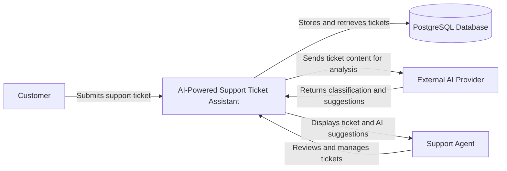
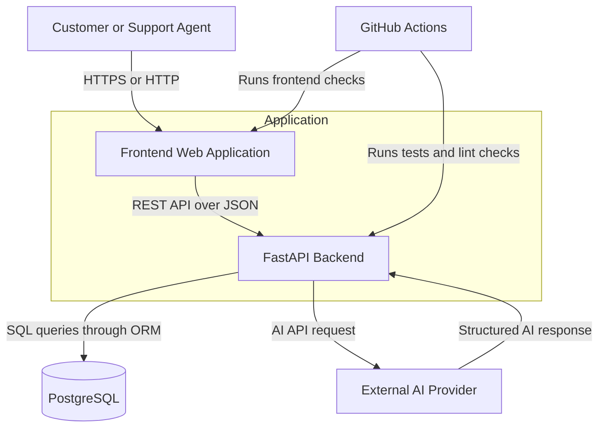
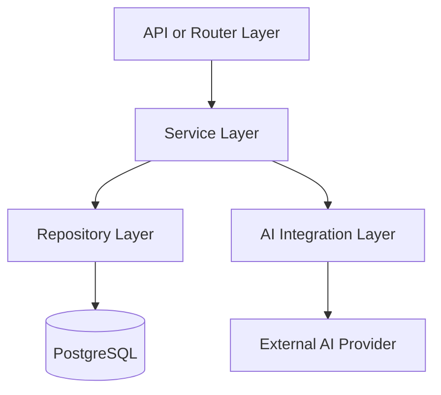
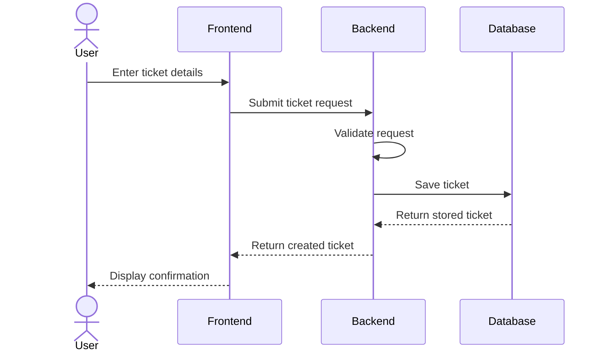
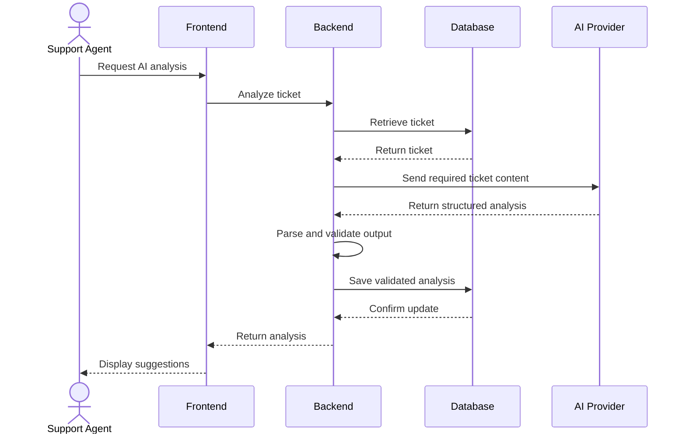
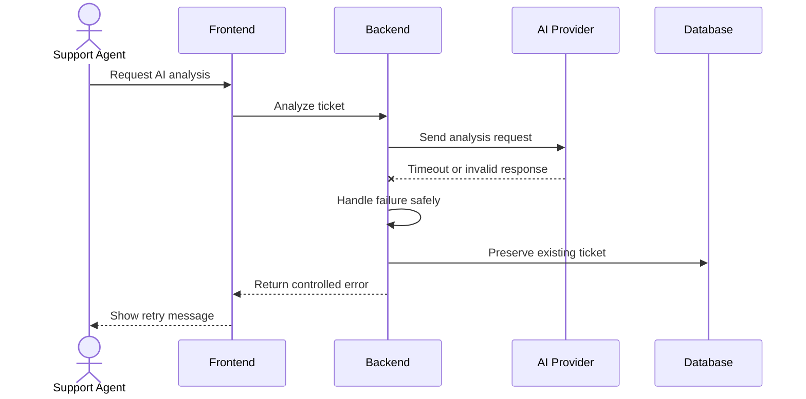
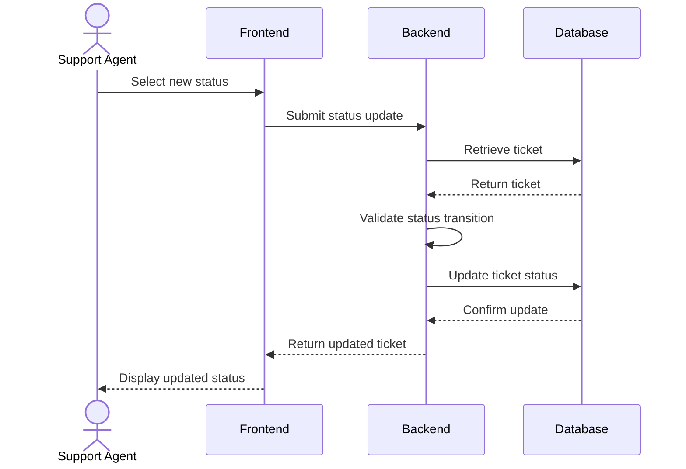
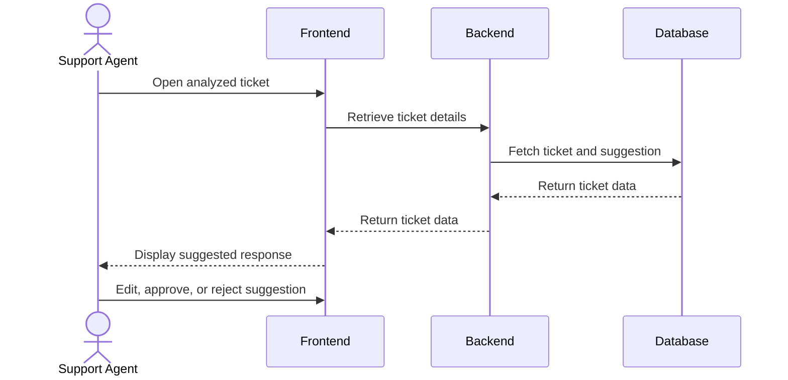
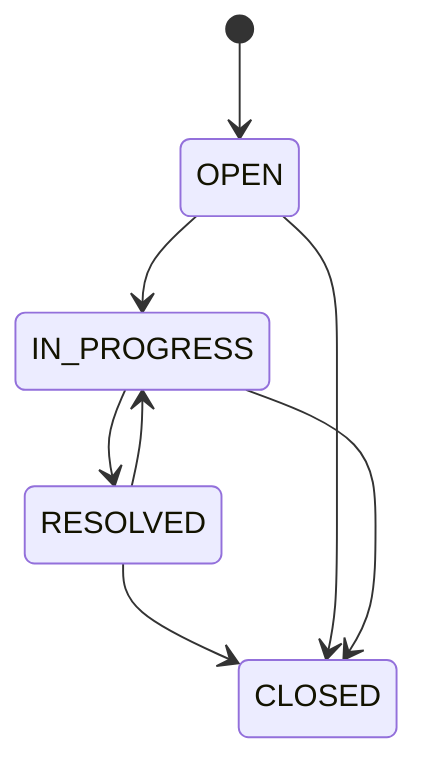
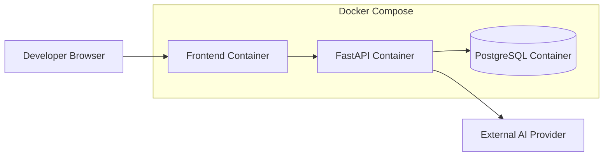

# AI-Powered Support Ticket Assistant

## High-Level Design Document

---

## 1. Document Information

| Field           | Value                               |
| --------------- | ----------------------------------- |
| Project Name    | AI-Powered Support Ticket Assistant |
| Document Type   | High-Level Design                   |
| Document Status | Draft                               |
| Version         | 1.0                                 |
| Author          | Raja Rangarao Moturi                |
| Last Updated    | 2026-07-26                          |

---

## 2. Purpose

This document describes the high-level architecture of the AI-Powered Support Ticket Assistant.

It explains:

* the major system components
* how components communicate
* the primary system workflows
* external dependencies
* data flow
* security considerations
* reliability considerations
* deployment architecture
* important design constraints

This document focuses on the overall architecture and does not define individual Python classes, functions, database columns, or implementation-specific logic.

---

## 3. System Overview

The AI-Powered Support Ticket Assistant is a web application that helps support teams process customer tickets.

Customers or support agents can submit support issues through the frontend. The FastAPI backend validates and stores the ticket in PostgreSQL.

When AI analysis is requested, the backend sends relevant ticket content to an external AI provider. The AI generates:

* ticket category
* ticket priority
* ticket summary
* recommended support team
* suggested customer response

The backend validates the AI-generated output before storing it.

Support agents can review, correct, approve, or reject AI-generated suggestions.

The system follows a human-in-the-loop approach. AI-generated responses will not be sent automatically to customers.

---

## 4. Architecture Goals

The architecture should support the following goals:

* beginner-friendly implementation
* clear separation of responsibilities
* maintainable backend structure
* reliable ticket storage
* safe AI integration
* structured AI output validation
* graceful handling of AI failures
* human review of AI suggestions
* local development through Docker
* automated testing through CI
* future extensibility without overengineering

---

## 5. Architecture Principles

The system will follow these principles:

### 5.1 Separation of Concerns

Each major part of the application should have a clear responsibility.

Examples include:

* frontend for user interaction
* backend for API and business logic
* database for persistent storage
* AI provider for ticket analysis
* CI pipeline for automated validation

### 5.2 Human-in-the-Loop AI

AI-generated information should be treated as a recommendation.

A support agent remains responsible for:

* reviewing AI classification
* correcting priority
* modifying the suggested response
* deciding whether a response is suitable

### 5.3 Validate External Output

The application must not trust AI output directly.

All AI-generated information must be:

* parsed
* validated
* checked against supported values
* rejected when malformed or unsupported

### 5.4 Fail Gracefully

The ticket-management system should continue working even when the AI provider is unavailable.

AI failure must not prevent:

* ticket creation
* ticket retrieval
* ticket updates
* ticket status changes

### 5.5 Start Simple

The MVP will avoid unnecessary distributed-system components.

The initial architecture will not include:

* Redis
* Kafka
* background workers
* Kubernetes
* vector databases
* multiple microservices
* multiple AI providers

---

## 6. System Context Diagram



---

## 7. High-Level Container Diagram



---

## 8. Major Components

## 8.1 Frontend Web Application

The frontend provides the user interface for customers and support agents.

Initial responsibilities include:

* ticket-submission form
* ticket-list view
* ticket-details view
* ticket-status updates
* AI-analysis request
* AI-generated result display
* suggested-response review
* error-message display

The frontend communicates with the backend using REST APIs and JSON.

The frontend does not communicate directly with PostgreSQL or the AI provider.

---

## 8.2 FastAPI Backend

The FastAPI backend is the central application component.

Its responsibilities include:

* exposing REST APIs
* validating incoming requests
* executing business rules
* managing ticket operations
* communicating with PostgreSQL
* communicating with the AI provider
* validating AI output
* formatting API responses
* handling application exceptions
* recording application logs
* exposing health and readiness endpoints

The backend acts as the trusted boundary between the frontend, database, and AI provider.

---

## 8.3 PostgreSQL Database

PostgreSQL provides persistent storage for ticket information.

The database stores information such as:

* customer information
* ticket subject
* ticket description
* ticket status
* ticket category
* ticket priority
* assigned support team
* AI-generated summary
* AI-generated response suggestion
* AI-analysis status
* timestamps

PostgreSQL is the source of truth for ticket data.

The frontend and AI provider will not access the database directly.

---

## 8.4 External AI Provider

The AI provider analyzes ticket content.

The AI provider is expected to generate:

* supported ticket category
* supported ticket priority
* concise ticket summary
* recommended support team
* suggested support response

The backend sends only the information required for analysis.

The AI provider is treated as an external and potentially unreliable dependency.

The backend must handle:

* request timeout
* provider unavailability
* invalid JSON
* unsupported values
* incomplete output
* authentication failure
* rate-limit errors

---

## 8.5 GitHub Repository

GitHub will store:

* source code
* documentation
* application configuration templates
* Docker configuration
* test files
* CI workflows
* issue and pull-request history

The project will use:

* `main` branch for stable releases
* `develop` branch for integrated development
* `feature/*` branches for individual features

---

## 8.6 GitHub Actions

GitHub Actions will provide Continuous Integration.

Initial CI responsibilities include:

* installing dependencies
* running backend tests
* running backend lint checks
* running frontend tests later
* running frontend lint checks later
* reporting failures before merge

Automated deployment is not part of the initial MVP.

---

## 8.7 Docker Compose

Docker Compose will provide a reproducible local development environment.

The initial Docker Compose environment will include:

* backend service
* PostgreSQL service
* frontend service after frontend setup

Redis will not be included until a real caching, rate-limiting, or background-processing requirement exists.

---

## 9. Backend Logical Architecture

The backend will follow a layered architecture.



### 9.1 API or Router Layer

Responsibilities:

* receive HTTP requests
* extract path, query, and body data
* trigger request validation
* call the appropriate service
* return HTTP responses
* apply response status codes

The API layer should not contain database queries or AI-provider logic.

### 9.2 Service Layer

Responsibilities:

* execute business rules
* coordinate ticket operations
* coordinate AI analysis
* determine valid ticket transitions
* handle application-level decisions
* combine repository and AI-service results

The service layer represents the main business logic of the application.

### 9.3 Repository Layer

Responsibilities:

* create database records
* retrieve database records
* update database records
* delete or close records
* perform filtering
* perform pagination
* isolate database-access logic

### 9.4 AI Integration Layer

Responsibilities:

* build AI requests
* send requests to the selected AI provider
* apply timeouts
* parse AI output
* validate AI output
* convert provider errors into application errors

### 9.5 Schema and Validation Layer

Responsibilities:

* validate incoming API requests
* define outgoing API response structures
* validate AI-generated structured output
* enforce supported categories, statuses, and priorities

### 9.6 Exception-Handling Layer

Responsibilities:

* convert application exceptions into HTTP responses
* provide consistent error structures
* avoid exposing internal exception details
* record unexpected failures

### 9.7 Configuration Layer

Responsibilities:

* load environment-specific settings
* manage database configuration
* manage AI-provider configuration
* manage allowed frontend origins
* manage logging configuration
* validate required environment variables

---

## 10. Primary System Workflows

## 10.1 Ticket Creation Workflow



### Workflow Description

1. The user enters the ticket information.
2. The frontend submits the ticket to the backend.
3. The backend validates the request.
4. The backend creates the ticket with a default status.
5. PostgreSQL stores the ticket.
6. The backend returns the created ticket.
7. The frontend displays the result.

AI analysis is not required for ticket creation.

---

## 10.2 AI Ticket Analysis Workflow



### Workflow Description

1. The support agent requests AI analysis.
2. The backend retrieves the ticket.
3. The backend prepares the AI request.
4. Only necessary ticket information is sent.
5. The AI provider returns structured output.
6. The backend validates the generated values.
7. Valid output is stored in PostgreSQL.
8. The frontend displays the suggestions.
9. The support agent reviews the output.

---

## 10.3 AI Failure Workflow



### Workflow Description

1. The support agent requests AI analysis.
2. The AI provider fails or returns invalid output.
3. The backend catches the failure.
4. Existing ticket information remains unchanged.
5. A controlled error response is returned.
6. The support agent may retry later.

---

## 10.4 Ticket Status Update Workflow



---

## 10.5 Suggested Response Review Workflow



The MVP will not send the approved response to the customer.

---

## 11. Data Flow

### 11.1 Ticket Data Flow

```text
User
→ Frontend
→ FastAPI Backend
→ Request Validation
→ Business Service
→ Repository
→ PostgreSQL
```

### 11.2 AI Analysis Data Flow

```text
Support Agent
→ Frontend
→ FastAPI Backend
→ Ticket Retrieval
→ AI Integration Service
→ External AI Provider
→ AI Output Validation
→ PostgreSQL
→ Support Agent Review
```

### 11.3 Error Data Flow

```text
Internal or External Failure
→ Exception Handler
→ Structured Error Response
→ Frontend
→ User-Friendly Error Message
```

---

## 12. Data Ownership

| Data                          | Owner or Source of Truth    |
| ----------------------------- | --------------------------- |
| Ticket details                | PostgreSQL                  |
| Ticket status                 | PostgreSQL                  |
| Ticket category               | PostgreSQL after validation |
| Ticket priority               | PostgreSQL after validation |
| AI summary                    | PostgreSQL after validation |
| Suggested response            | PostgreSQL after validation |
| Application configuration     | Environment variables       |
| Source code                   | GitHub                      |
| Documentation                 | GitHub                      |
| AI-generated temporary output | Backend until validated     |

The external AI provider is not considered the source of truth.

---

## 13. API Communication

The frontend will communicate with the backend using REST APIs.

The initial API design will use:

* JSON request bodies
* JSON response bodies
* HTTP status codes
* versioned API paths
* structured validation errors
* structured application errors
* page-based pagination
* query-parameter filtering

The detailed contracts will be documented in `docs/API_SPEC.md`.

---

## 14. Ticket Lifecycle

The initial ticket lifecycle is:



### Status Meaning

| Status        | Meaning                                                           |
| ------------- | ----------------------------------------------------------------- |
| `OPEN`        | Ticket has been created but work has not started                  |
| `IN_PROGRESS` | A support agent is actively handling the ticket                   |
| `RESOLVED`    | A solution has been provided or the issue is believed to be fixed |
| `CLOSED`      | Ticket processing is complete                                     |

The exact transition rules will be defined in the LLD.

---

## 15. AI Analysis Status

The ticket may have a separate AI-analysis status.

Suggested values include:

| Status           | Meaning                                   |
| ---------------- | ----------------------------------------- |
| `NOT_REQUESTED`  | AI analysis has not been requested        |
| `IN_PROGRESS`    | AI analysis is currently being processed  |
| `COMPLETED`      | AI analysis completed successfully        |
| `FAILED`         | AI analysis failed                        |
| `INVALID_OUTPUT` | AI returned output that failed validation |

For the MVP, synchronous AI processing may make the `IN_PROGRESS` state very short. It is still useful for future extensibility.

---

## 16. Security Architecture

## 16.1 Secret Management

Secrets must be stored through environment variables.

Examples include:

* database password
* AI-provider API key
* application secret values

Secrets must not be committed to GitHub.

The repository will contain `.env.example` files containing placeholders only.

## 16.2 Input Validation

All external input must be validated.

This includes:

* customer name
* email address
* ticket subject
* ticket description
* ticket status
* ticket category
* ticket priority
* pagination values
* filter values

## 16.3 AI Output Validation

AI-generated output must be treated as untrusted input.

The backend must verify:

* required fields are present
* category is supported
* priority is supported
* summary is within acceptable limits
* recommended team is valid
* response suggestion is a string
* the structure matches the expected contract

## 16.4 Logging Protection

Logs should not expose:

* API keys
* database passwords
* complete customer ticket descriptions
* unnecessary customer email addresses
* AI-provider authentication details

## 16.5 CORS

The backend should allow requests only from configured frontend origins.

Development and production environments may use different allowed origins.

## 16.6 Authentication

Authentication and authorization are outside the MVP scope.

They should be added before the system is used with real customer information or deployed as a production support platform.

---

## 17. Reliability and Failure Handling

The system should handle failures at component boundaries.

### 17.1 Database Failure

Possible failures include:

* database unavailable
* invalid credentials
* connection exhaustion
* query failure
* transaction failure

Expected behavior:

* return a controlled server error
* record the failure
* avoid exposing database details
* roll back incomplete transactions
* report database failure through readiness checks

### 17.2 AI Provider Failure

Possible failures include:

* timeout
* network failure
* invalid API key
* provider outage
* rate limiting
* malformed response
* unsupported output values

Expected behavior:

* preserve the ticket
* avoid storing invalid analysis
* return a controlled error
* allow retry
* record the failure without logging sensitive content

### 17.3 Frontend Failure

Possible failures include:

* backend unavailable
* slow AI response
* invalid form input
* expired request
* unexpected API response

Expected behavior:

* display a clear error
* preserve user-entered data when possible
* allow retry
* avoid showing raw backend errors

---

## 18. Health and Readiness

The application will expose two operational checks.

### 18.1 Health Check

The health check confirms that the FastAPI process is running.

It should not depend on external services.

Expected use:

* local verification
* container health checks
* deployment health monitoring

### 18.2 Readiness Check

The readiness check confirms that the application is ready to handle requests.

It should verify critical dependencies such as:

* PostgreSQL connectivity
* required configuration availability

AI-provider connectivity may not be checked on every readiness request because that could create unnecessary external requests and cost.

---

## 19. Performance Considerations

The MVP is not designed for high-scale production traffic, but it should avoid obvious performance problems.

The system should:

* use pagination for ticket lists
* use database indexes for frequently filtered fields
* avoid retrieving unnecessary columns
* avoid sending unnecessary ticket data to the AI provider
* configure AI timeouts
* avoid repeatedly analyzing unchanged tickets without warning
* manage database sessions correctly
* avoid loading every ticket into memory

---

## 20. Scalability Considerations

The initial architecture uses a single backend application.

Future scaling options may include:

* multiple backend instances
* managed PostgreSQL
* connection pooling
* background task processing
* Redis caching
* queue-based AI processing
* rate limiting
* load balancing
* object storage for attachments
* separate analytics service
* monitoring and distributed tracing

These changes should be introduced only when justified by measured requirements.

---

## 21. Deployment Architecture

### 21.1 Local Development Deployment



### 21.2 Initial Service Ports

The expected local ports are:

| Service    | Local Port |
| ---------- | ---------- |
| Frontend   | `3000`     |
| Backend    | `8000`     |
| PostgreSQL | `5432`     |

Port values may be changed through configuration when required.

### 21.3 Future Cloud Deployment

A future cloud environment may contain:

* static frontend hosting
* containerized backend service
* managed PostgreSQL
* secrets manager
* centralized logging
* monitoring and alerting
* HTTPS gateway or load balancer

The exact cloud provider is not selected in the MVP.

---

## 22. Environment Strategy

The project may support the following environments:

| Environment | Purpose                                     |
| ----------- | ------------------------------------------- |
| Local       | Developer machine execution                 |
| Test        | Automated test execution                    |
| Development | Shared development deployment in the future |
| Production  | Real-user deployment in the future          |

Each environment should use separate:

* configuration
* database
* AI credentials
* allowed frontend origins
* log settings

---

## 23. Observability

The MVP should include structured application logging.

Important events include:

* application startup
* application shutdown
* ticket creation
* ticket update
* ticket status change
* AI-analysis request
* AI-analysis success
* AI-analysis failure
* database failure
* request-validation failure
* unexpected exception

Future observability improvements may include:

* metrics
* distributed tracing
* error monitoring
* latency dashboards
* AI token-usage tracking
* AI cost tracking
* model-quality monitoring

---

## 24. Testing Architecture

The system should support:

### 24.1 Unit Testing

Used for:

* business rules
* ticket-status transitions
* validation utilities
* AI-output parsing
* error mapping

### 24.2 Integration Testing

Used for:

* API and service integration
* repository and PostgreSQL integration
* request validation
* exception handling

### 24.3 AI Integration Testing

The automated test suite should not depend entirely on live AI calls.

AI tests should use controlled mock responses for:

* valid output
* malformed output
* missing fields
* unsupported category
* unsupported priority
* timeout
* provider failure

### 24.4 End-to-End Testing

Later tests may verify:

* frontend ticket submission
* ticket retrieval
* AI-analysis request
* ticket-status update

Detailed testing strategy will be documented in `docs/TESTING.md`.

---

## 25. Technology Stack

| Area                | Selected Technology    |
| ------------------- | ---------------------- |
| Backend Language    | Python                 |
| Backend Framework   | FastAPI                |
| ASGI Server         | Uvicorn                |
| Database            | PostgreSQL             |
| ORM                 | SQLAlchemy             |
| Validation          | Pydantic               |
| Frontend            | To be finalized        |
| AI Provider         | To be finalized        |
| Testing             | Pytest                 |
| API Documentation   | OpenAPI and Swagger UI |
| Containerization    | Docker                 |
| Local Orchestration | Docker Compose         |
| CI                  | GitHub Actions         |
| Version Control     | Git                    |
| Repository Hosting  | GitHub                 |

The final frontend and AI-provider decisions will be recorded through ADRs.

---

## 26. Architecture Decisions Required

The following decisions will be documented as ADRs:

1. Use FastAPI as the backend framework.
2. Use PostgreSQL as the primary database.
3. Use SQLAlchemy as the ORM.
4. Use a layered backend architecture.
5. Integrate one external AI provider through an AI-service abstraction.
6. Require human review of AI-generated responses.
7. Use Docker Compose for local development.

Additional ADRs may later cover:

* frontend framework
* database migrations
* ticket-deletion strategy
* AI-analysis execution strategy
* authentication
* cloud deployment

---

## 27. Architecture Risks

| Risk                                        | Architectural Response                                  |
| ------------------------------------------- | ------------------------------------------------------- |
| AI output is invalid                        | Validate all AI output before storing                   |
| AI provider is unavailable                  | Keep ticket management independent from AI availability |
| Sensitive data reaches logs                 | Apply log sanitization                                  |
| Database becomes unavailable                | Use readiness checks and controlled errors              |
| Scope becomes too large                     | Keep Redis, Kafka, RAG, and Kubernetes outside the MVP  |
| Business logic enters API routes            | Use service and repository layers                       |
| Frontend accesses external systems directly | Route database and AI operations through the backend    |
| Live AI tests become expensive              | Use mocked AI responses in automated tests              |
| AI suggestion is treated as final           | Require human review                                    |

---

## 28. Open Architecture Questions

The following questions will be finalized in the LLD or ADRs:

* Which frontend framework will be used?
* Which AI provider will be selected?
* Should AI analysis run automatically after ticket creation?
* Should AI analysis be synchronous or asynchronous?
* Can agents regenerate an analysis?
* Should previous AI results be retained?
* Should tickets be permanently deleted?
* How will support teams be represented?
* Should corrected AI values be recorded separately?
* Will database schemas be managed using Alembic from the beginning?

---

## 29. HLD Review Checklist

* [ ] The system context is clearly documented
* [ ] Major system components are identified
* [ ] Component responsibilities are separated
* [ ] Ticket creation flow is documented
* [ ] AI-analysis flow is documented
* [ ] AI-failure flow is documented
* [ ] Human review is included
* [ ] PostgreSQL is the source of truth
* [ ] AI output is treated as untrusted
* [ ] Health and readiness responsibilities are separated
* [ ] Security boundaries are documented
* [ ] Failure-handling expectations are documented
* [ ] Docker Compose architecture is documented
* [ ] Redis is excluded from the MVP
* [ ] Kafka is excluded from the MVP
* [ ] Future scaling options are separated from MVP architecture
* [ ] Open questions are identified

---

## 30. Related Documents

| Document               | Location                     |
| ---------------------- | ---------------------------- |
| Problem Definition     | `docs/PROBLEM_DEFINITION.md` |
| Requirements Document  | `docs/REQUIREMENTS.md`       |
| Low-Level Design       | `docs/LLD.md`                |
| API Specification      | `docs/API_SPEC.md`           |
| Testing Strategy       | `docs/TESTING.md`            |
| Security Guidelines    | `docs/SECURITY.md`           |
| Architecture Decisions | `docs/adr/`                  |
| Setup Guide            | `docs/SETUP.md`              |
| Deployment Guide       | `docs/DEPLOYMENT.md`         |

---

## 31. Document History

| Version | Date       | Author               | Description                        |
| ------- | ---------- | -------------------- | ---------------------------------- |
| 1.0     | 2026-07-26 | Raja Rangarao Moturi | Initial High-Level Design document |
