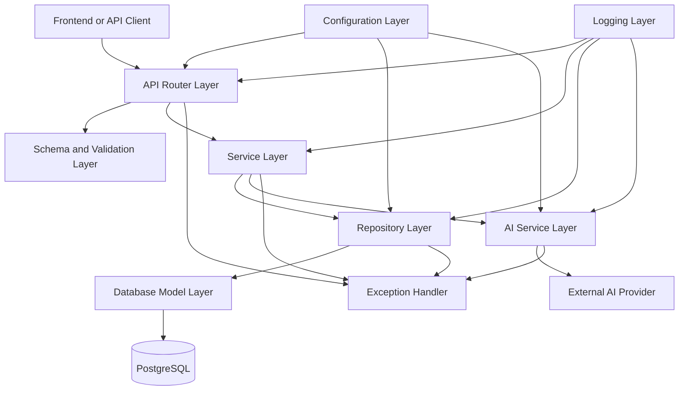
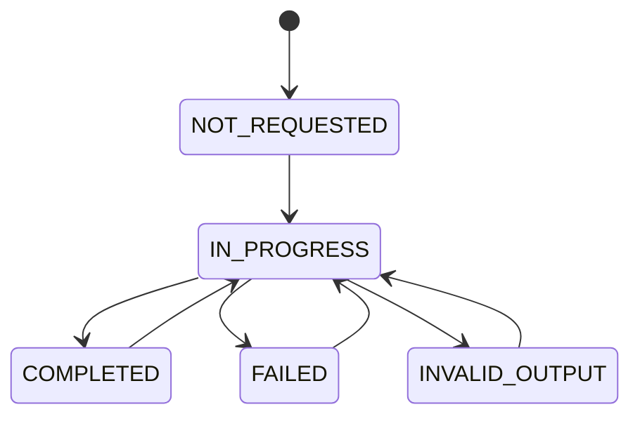
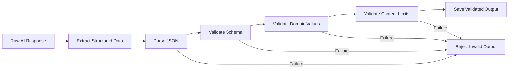

# AI-Powered Support Ticket Assistant

## Low-Level Design Document

---

## 1. Document Information

| Field           | Value                               |
| --------------- | ----------------------------------- |
| Project Name    | AI-Powered Support Ticket Assistant |
| Document Type   | Low-Level Design                    |
| Document Status | Draft                               |
| Version         | 1.0                                 |
| Author          | Raja Rangarao Moturi                |
| Last Updated    | 2026-07-26                          |

---

## 2. Purpose

This document describes the detailed internal design of the AI-Powered Support Ticket Assistant.

It defines:

* backend module organization
* responsibilities of each application layer
* domain entities
* database schema
* ticket lifecycle rules
* AI-analysis workflow
* request and response models
* validation rules
* exception-handling strategy
* logging strategy
* configuration management
* database transaction boundaries
* testing boundaries

This document translates the architecture described in `docs/HLD.md` into an implementation-ready design.

---

## 3. Design Scope

This Low-Level Design covers the MVP version of the system.

The MVP includes:

* ticket creation
* ticket retrieval
* ticket listing
* ticket updates
* ticket status management
* ticket filtering
* pagination
* AI ticket analysis
* AI-generated response suggestions
* AI-output validation
* health and readiness checks
* structured error handling
* PostgreSQL persistence

The following remain outside the MVP:

* authentication
* authorization
* email sending
* background job queues
* Redis
* Kafka
* RAG
* vector databases
* file attachments
* multiple AI providers
* advanced analytics
* microservices

---

## 4. Backend Design Approach

The backend will use a layered modular architecture.



---

## 5. Proposed Backend Module Structure

The planned backend structure is:

```text
src/backend/
├── app/
│   ├── main.py
│   │
│   ├── api/
│   │   ├── dependencies.py
│   │   └── v1/
│   │       ├── router.py
│   │       ├── health_routes.py
│   │       └── ticket_routes.py
│   │
│   ├── core/
│   │   ├── config.py
│   │   └── logging.py
│   │
│   ├── database/
│   │   ├── base.py
│   │   ├── session.py
│   │   └── migrations/
│   │
│   ├── models/
│   │   └── ticket.py
│   │
│   ├── schemas/
│   │   ├── common.py
│   │   ├── error.py
│   │   ├── health.py
│   │   └── ticket.py
│   │
│   ├── repositories/
│   │   └── ticket_repository.py
│   │
│   ├── services/
│   │   ├── ticket_service.py
│   │   └── ai_service.py
│   │
│   ├── ai/
│   │   ├── client.py
│   │   ├── prompts.py
│   │   └── parsers.py
│   │
│   ├── exceptions/
│   │   ├── base.py
│   │   ├── ticket_exceptions.py
│   │   ├── ai_exceptions.py
│   │   └── handlers.py
│   │
│   └── constants/
│       ├── ticket_status.py
│       ├── ticket_category.py
│       ├── ticket_priority.py
│       └── ai_analysis_status.py
│
├── tests/
│   ├── unit/
│   ├── integration/
│   └── fixtures/
│
├── requirements.txt
├── Dockerfile
├── .env.example
└── alembic.ini
```

The exact file structure may evolve during implementation, but responsibilities should remain separated.

---

## 6. Module Responsibilities

## 6.1 Application Entry Point

The application entry point is responsible for:

* creating the FastAPI application
* loading application settings
* configuring logging
* configuring CORS
* registering routers
* registering exception handlers
* managing startup and shutdown events
* exposing API metadata
* initializing required application resources

The application entry point should not contain business logic.

---

## 6.2 API Router Layer

The API router layer is responsible for:

* defining API paths
* accepting path parameters
* accepting query parameters
* accepting request bodies
* applying request schemas
* calling service-layer operations
* selecting HTTP status codes
* returning response schemas

The router layer must not:

* execute database queries directly
* call the external AI provider directly
* contain complex business rules
* manage database commits manually
* expose raw internal exceptions

---

## 6.3 Schema and Validation Layer

The schema layer is responsible for defining:

* ticket-creation input
* ticket-update input
* ticket-status update input
* ticket response
* ticket-list response
* pagination metadata
* AI-analysis response
* health-check response
* readiness-check response
* error response
* AI-provider output contract

The schema layer must keep API models separate from database models.

This separation prevents the API contract from becoming tightly coupled to the database structure.

---

## 6.4 Service Layer

The service layer contains application business logic.

The ticket service is responsible for:

* creating tickets
* retrieving tickets
* updating tickets
* validating ticket-state transitions
* coordinating repository operations
* triggering AI analysis
* determining whether analysis can be regenerated
* deciding when ticket data may be modified
* mapping lower-level failures into application exceptions

The service layer coordinates operations but should not contain provider-specific AI request details.

---

## 6.5 Repository Layer

The repository layer is responsible for all ticket-related database operations.

Its responsibilities include:

* creating ticket records
* retrieving a ticket by ID
* listing tickets
* filtering tickets
* counting filtered results
* updating ticket records
* updating AI-analysis results
* deleting or closing tickets
* checking whether a ticket exists

The repository layer should not:

* return HTTP responses
* apply HTTP status codes
* call the AI provider
* define user-facing error messages
* contain API-specific validation

---

## 6.6 AI Service Layer

The AI service is responsible for:

* preparing analysis input
* selecting the configured model
* calling the AI provider
* applying provider timeout settings
* parsing the provider response
* validating structured AI output
* translating provider failures
* returning provider-independent analysis results

The service layer should depend on an abstract AI capability rather than provider-specific details where practical.

This allows the application to replace the AI provider later without modifying ticket business logic.

---

## 6.7 AI Client Module

The AI client module contains provider-specific communication logic.

Responsibilities include:

* API authentication
* request formatting
* model selection
* provider endpoint communication
* timeout configuration
* provider response extraction
* provider-specific error interpretation

The AI client should not update database records.

---

## 6.8 AI Prompt Module

The prompt module is responsible for maintaining prompts separately from business logic.

The analysis prompt should instruct the model to return:

* category
* priority
* summary
* recommended team
* suggested response

The prompt should clearly restrict category and priority values.

Prompt versions should be traceable so the project can later compare results between prompt changes.

---

## 6.9 AI Parser Module

The parser is responsible for:

* extracting structured output
* rejecting malformed responses
* checking required fields
* removing unsupported extra content when appropriate
* passing extracted data to the schema-validation layer

Parsing and validation are separate responsibilities:

* parsing converts provider output into structured data
* validation confirms that the structured data satisfies application rules

---

## 6.10 Exception Layer

The exception layer defines application-specific failures.

The exception handlers convert these failures into consistent HTTP responses.

The system should distinguish between:

* client errors
* resource-not-found errors
* business-rule violations
* database errors
* AI-provider errors
* AI-output validation errors
* configuration errors
* unexpected internal errors

---

## 6.11 Configuration Layer

The configuration layer manages environment-based settings.

It is responsible for:

* validating required configuration
* providing typed configuration values
* preventing direct environment access throughout the application
* separating local, test, and production settings

Expected settings include:

* application name
* application environment
* API version
* backend host
* backend port
* database URL
* database pool settings
* AI-provider API key
* AI model name
* AI timeout
* AI retry count
* allowed frontend origins
* log level
* pagination defaults
* pagination maximums

---

## 7. Domain Model

The main domain entity for the MVP is `Ticket`.

A separate `AIAnalysis` table is not required initially. AI-generated values can be stored on the ticket record.

A separate analysis-history entity may be introduced later if the system needs:

* multiple analyses per ticket
* prompt-version comparison
* model-version comparison
* AI quality evaluation
* complete correction history

---

## 8. Ticket Entity Design

The ticket entity contains the following conceptual fields.

| Field                | Purpose                                     | Required |
| -------------------- | ------------------------------------------- | -------- |
| `id`                 | Unique database identifier                  | Yes      |
| `public_id`          | User-facing ticket identifier               | Yes      |
| `customer_name`      | Name of the customer                        | Yes      |
| `customer_email`     | Customer contact email                      | Yes      |
| `subject`            | Short description of the issue              | Yes      |
| `description`        | Detailed explanation of the issue           | Yes      |
| `status`             | Current ticket lifecycle state              | Yes      |
| `category`           | Ticket issue category                       | No       |
| `priority`           | Ticket urgency                              | Yes      |
| `assigned_team`      | Recommended or selected support team        | No       |
| `ai_summary`         | AI-generated short summary                  | No       |
| `suggested_response` | AI-generated response suggestion            | No       |
| `ai_analysis_status` | Current state of AI analysis                | Yes      |
| `ai_model`           | Model used for the last successful analysis | No       |
| `prompt_version`     | Prompt version used for analysis            | No       |
| `ai_analyzed_at`     | Time of the last successful analysis        | No       |
| `created_at`         | Ticket creation timestamp                   | Yes      |
| `updated_at`         | Last modification timestamp                 | Yes      |
| `closed_at`          | Ticket closure timestamp                    | No       |

---

## 9. Identifier Strategy

The system should distinguish between:

* internal database identifier
* public ticket identifier

### 9.1 Internal Identifier

The internal identifier is used for:

* database relationships
* indexing
* internal query operations

### 9.2 Public Identifier

The public identifier is shown to users and used in API paths where practical.

Example format:

```text
TKT-20260726-000001
```

Benefits include:

* easier communication with support agents
* reduced exposure of sequential database identifiers
* more recognizable ticket references

For a simpler first implementation, the project may initially expose the internal identifier. The final selection should be documented as an ADR or LLD revision.

---

## 10. Database Schema

## 10.1 Tickets Table

| Column               | Conceptual Type         | Null Allowed | Default         | Notes                      |
| -------------------- | ----------------------- | -----------: | --------------- | -------------------------- |
| `id`                 | Integer or big integer  |           No | Generated       | Primary key                |
| `public_id`          | String                  |           No | Generated       | Unique user-facing ID      |
| `customer_name`      | String                  |           No | None            | Customer name              |
| `customer_email`     | String                  |           No | None            | Valid email format         |
| `subject`            | String                  |           No | None            | Short issue title          |
| `description`        | Text                    |           No | None            | Full issue description     |
| `status`             | String or database enum |           No | `OPEN`          | Ticket lifecycle state     |
| `category`           | String or database enum |          Yes | Null            | Set manually or by AI      |
| `priority`           | String or database enum |           No | `MEDIUM`        | Default priority           |
| `assigned_team`      | String                  |          Yes | Null            | Suggested or selected team |
| `ai_summary`         | Text                    |          Yes | Null            | Validated AI summary       |
| `suggested_response` | Text                    |          Yes | Null            | Validated AI suggestion    |
| `ai_analysis_status` | String or enum          |           No | `NOT_REQUESTED` | AI execution state         |
| `ai_model`           | String                  |          Yes | Null            | Last successful model      |
| `prompt_version`     | String                  |          Yes | Null            | Last prompt version        |
| `ai_analyzed_at`     | Timestamp               |          Yes | Null            | Last successful analysis   |
| `created_at`         | Timestamp               |           No | Current time    | Creation time              |
| `updated_at`         | Timestamp               |           No | Current time    | Modification time          |
| `closed_at`          | Timestamp               |          Yes | Null            | Closure time               |

---

## 10.2 Database Constraints

The tickets table should enforce:

* primary key uniqueness
* public ticket ID uniqueness
* non-null required fields
* supported status values
* supported priority values
* supported category values when category is present
* valid AI-analysis status values
* reasonable field-length limits

Email-format validation will primarily occur in the application because database-level email validation may become overly restrictive.

---

## 10.3 Database Indexes

Recommended initial indexes:

| Index                                        | Reason                     |
| -------------------------------------------- | -------------------------- |
| Primary-key index on `id`                    | Direct ticket lookup       |
| Unique index on `public_id`                  | Public ticket lookup       |
| Index on `status`                            | Common ticket filtering    |
| Index on `priority`                          | Priority filtering         |
| Index on `category`                          | Category filtering         |
| Index on `customer_email`                    | Customer lookup            |
| Index on `created_at`                        | Sorting and date filtering |
| Composite index on `status` and `created_at` | Queue-style ticket listing |

Indexes should be added based on expected query patterns and later verified through database query analysis.

---

## 11. Ticket Category Design

Supported categories:

| Category    | Description                                                | Recommended Team  |
| ----------- | ---------------------------------------------------------- | ----------------- |
| `PAYMENT`   | Payment failure, duplicate charge, or payment-status issue | Payments Support  |
| `DELIVERY`  | Shipping delay, missing delivery, or delivery-status issue | Delivery Support  |
| `ACCOUNT`   | Login, profile, password, or account-access issue          | Account Support   |
| `REFUND`    | Refund request, delayed refund, or incorrect refund        | Refund Support    |
| `TECHNICAL` | Application error, system failure, or technical defect     | Technical Support |
| `OTHER`     | Issue does not match a supported category                  | General Support   |

The recommended team is a suggestion and may be changed by a support agent.

---

## 12. Ticket Priority Design

Supported priorities:

| Priority   | Meaning                                                             |
| ---------- | ------------------------------------------------------------------- |
| `LOW`      | Minor inconvenience with no major customer impact                   |
| `MEDIUM`   | Standard issue requiring normal support handling                    |
| `HIGH`     | Significant issue requiring faster attention                        |
| `CRITICAL` | Severe issue involving major impact, security, or urgent escalation |

### 12.1 Default Priority

A newly created ticket receives `MEDIUM` priority before AI or manual review.

### 12.2 Priority Safety Rule

The AI may recommend a priority, but the system must not automatically perform irreversible actions based only on AI priority.

A support agent may correct the priority.

---

## 13. Ticket Status Lifecycle

Supported statuses:

* `OPEN`
* `IN_PROGRESS`
* `RESOLVED`
* `CLOSED`

## 13.1 Allowed Status Transitions

| Current Status | Allowed Next Status     |
| -------------- | ----------------------- |
| `OPEN`         | `IN_PROGRESS`, `CLOSED` |
| `IN_PROGRESS`  | `RESOLVED`, `CLOSED`    |
| `RESOLVED`     | `IN_PROGRESS`, `CLOSED` |
| `CLOSED`       | None in the MVP         |

### 13.2 Status Rules

* New tickets begin in `OPEN`.
* A ticket moves to `IN_PROGRESS` when support work begins.
* A ticket moves to `RESOLVED` when a solution has been provided.
* A ticket moves to `CLOSED` when no further action is required.
* Reopening a `CLOSED` ticket is outside the MVP.
* Moving a `RESOLVED` ticket back to `IN_PROGRESS` is allowed when the issue continues.
* `closed_at` is populated when the ticket becomes `CLOSED`.
* `closed_at` remains empty for all other states.

---

## 14. Ticket Deletion Strategy

The MVP will use **logical closure instead of permanent deletion** for normal user operations.

This means:

* tickets are moved to `CLOSED`
* ticket history remains available
* support information is not accidentally removed
* analytics remain accurate

A permanent-delete operation should not be exposed in the initial public API.

Permanent deletion may later be introduced for:

* test-data cleanup
* privacy compliance
* administrative maintenance

This decision should be documented in an ADR if adopted.

---

## 15. AI Analysis Status Lifecycle

Supported AI-analysis statuses:

* `NOT_REQUESTED`
* `IN_PROGRESS`
* `COMPLETED`
* `FAILED`
* `INVALID_OUTPUT`



### 15.1 Status Rules

* A new ticket begins with `NOT_REQUESTED`.
* AI analysis changes the status to `IN_PROGRESS`.
* Valid AI output changes the status to `COMPLETED`.
* Provider or network errors change the status to `FAILED`.
* Structurally invalid output changes the status to `INVALID_OUTPUT`.
* A support agent may request analysis again after failure.
* Regeneration after successful analysis is allowed but should require an explicit request.
* Existing valid analysis should not be erased until replacement analysis succeeds.

---

## 16. AI Analysis Design

## 16.1 AI Input

The AI analysis request may include:

* ticket subject
* ticket description
* supported categories
* supported priority values
* expected response structure
* instructions to avoid unsupported assumptions

The following should not be sent unless required:

* internal database ID
* database configuration
* AI-provider credentials
* unrelated customer records
* application logs
* infrastructure details

---

## 16.2 Expected AI Output

The expected structured AI result contains:

| Field                | Required | Validation                                    |
| -------------------- | -------: | --------------------------------------------- |
| `category`           |      Yes | Must match a supported category               |
| `priority`           |      Yes | Must match a supported priority               |
| `summary`            |      Yes | Must satisfy length limits                    |
| `recommended_team`   |      Yes | Must be a supported team or acceptable string |
| `suggested_response` |      Yes | Must satisfy length and content limits        |
| `reasoning_summary`  | Optional | Short explanation for agent review            |

Detailed internal chain-of-thought output should not be requested or stored.

A concise reasoning summary may explain which ticket facts influenced the recommendation.

---

## 16.3 AI Output Validation Pipeline



The application must not save partially validated AI output.

---

## 16.4 AI Timeout

The AI request must use a configurable timeout.

When timeout occurs:

* mark the analysis attempt as failed
* retain existing ticket information
* retain previous successful analysis
* return a controlled error
* allow retry

The specific timeout value will be defined through configuration rather than hardcoded throughout the application.

---

## 16.5 AI Retry Strategy

For the MVP:

* automatic retry should be limited
* retry should occur only for temporary provider or network failures
* invalid structured output should not be repeatedly retried without changing the request
* the user should be able to manually request analysis again

An excessive retry policy could increase cost and response time.

---

## 16.6 AI Regeneration

AI analysis may be regenerated when:

* previous analysis failed
* previous output was invalid
* the ticket description changed
* the support agent explicitly requests a new analysis

The system should display or record that regeneration occurred.

For the MVP, only the latest successful analysis needs to be retained.

---

## 16.7 AI Consistency Protection

To reduce inconsistent output:

* use fixed supported category values
* use fixed supported priority values
* use a versioned prompt
* use structured response output
* keep randomness low where provider configuration allows
* validate all returned fields
* avoid asking the model to invent customer facts

---

## 17. Support Team Design

Initial support teams:

| Team              | Supported Categories |
| ----------------- | -------------------- |
| Payments Support  | `PAYMENT`            |
| Delivery Support  | `DELIVERY`           |
| Account Support   | `ACCOUNT`            |
| Refund Support    | `REFUND`             |
| Technical Support | `TECHNICAL`          |
| General Support   | `OTHER`              |

For the MVP, support teams may be represented as controlled values rather than a separate database table.

A separate support-team table may be introduced when the system needs:

* configurable teams
* agent assignments
* team managers
* workload balancing
* team availability
* SLA rules

---

## 18. Request Model Design

## 18.1 Create Ticket Request

Expected information:

* customer name
* customer email
* subject
* description

The client cannot assign:

* ticket ID
* status
* timestamps
* AI-analysis status
* AI-generated values

These values are controlled by the backend.

---

## 18.2 Update Ticket Request

Permitted fields may include:

* customer name
* customer email
* subject
* description

AI-generated fields should not be updated through the general ticket-update operation.

Manual correction of AI values should use a separate operation or clearly controlled request model.

---

## 18.3 Status Update Request

Expected information:

* new status

The service layer validates whether the requested transition is allowed.

---

## 18.4 Manual AI Correction Request

A future or optional MVP operation may allow an agent to correct:

* category
* priority
* assigned team
* AI summary
* suggested response

The system should distinguish between:

* AI-generated value
* agent-approved or agent-corrected value

For the simplest MVP, corrected values may overwrite the current values. Audit history can be added later.

---

## 18.5 Ticket Filter Request

Supported filters:

* status
* category
* priority
* assigned team
* customer email
* AI-analysis status
* created-from date
* created-to date
* search text

The first implementation may begin with fewer filters and add the rest incrementally.

---

## 19. Pagination Design

The ticket-list operation uses page-based pagination.

Expected parameters:

| Parameter   | Purpose                    |
| ----------- | -------------------------- |
| `page`      | Requested page number      |
| `page_size` | Number of tickets per page |

Recommended rules:

* page begins at `1`
* default page size is configured
* maximum page size is configured
* values below the minimum are rejected
* values above the maximum are rejected or capped consistently

The response should contain:

* tickets
* current page
* page size
* total records
* total pages
* whether a next page exists
* whether a previous page exists

---

## 20. Sorting Design

The ticket-list endpoint should support controlled sorting.

Supported sort fields may include:

* creation time
* update time
* priority
* status

Default sorting:

* newest tickets first

The client must not be allowed to provide arbitrary database column names.

---

## 21. Search Design

The MVP may support basic text search across:

* ticket subject
* ticket description
* public ticket ID
* customer email

For the initial ticket volume, PostgreSQL text matching is sufficient.

Advanced search technologies are outside the MVP.

---

## 22. Validation Rules

## 22.1 Customer Name

Recommended rules:

* required
* leading and trailing whitespace removed
* minimum length enforced
* maximum length enforced
* cannot contain only whitespace

## 22.2 Customer Email

Recommended rules:

* required
* valid email structure
* normalized where appropriate
* maximum length enforced

## 22.3 Subject

Recommended rules:

* required
* cannot contain only whitespace
* minimum length enforced
* maximum length enforced

## 22.4 Description

Recommended rules:

* required
* cannot contain only whitespace
* minimum length enforced
* maximum length enforced
* should contain enough context for ticket processing

## 22.5 Category

Recommended rules:

* optional before analysis
* must match a supported category when provided

## 22.6 Priority

Recommended rules:

* default is `MEDIUM`
* must match a supported priority

## 22.7 Status

Recommended rules:

* must match a supported status
* transition must be permitted by business rules

## 22.8 Suggested Response

Recommended rules:

* must not be empty after successful analysis
* maximum length enforced
* treated as a draft
* must not claim that an action has already occurred unless supported by ticket data

---

## 23. API Response Design

The API should use predictable response structures.

### 23.1 Single Resource Response

Contains:

* ticket data
* AI-analysis information
* timestamps

### 23.2 Collection Response

Contains:

* list of tickets
* pagination metadata
* applied filters where useful

### 23.3 Operation Response

For actions such as AI analysis or status change, the response should include:

* updated ticket
* operation result
* updated timestamp

### 23.4 Error Response

Contains:

* stable application error code
* readable message
* request path
* timestamp
* optional field-level details
* request or correlation identifier when implemented

---

## 24. Exception Design

## 24.1 Application Exception Categories

| Exception Category       | Example                         |
| ------------------------ | ------------------------------- |
| Validation failure       | Unsupported status value        |
| Ticket not found         | Requested ticket does not exist |
| Invalid state transition | `CLOSED` to `OPEN`              |
| Database failure         | Query or transaction failed     |
| AI configuration failure | Missing API key                 |
| AI provider failure      | Provider timeout or outage      |
| AI output failure        | Invalid structured output       |
| Conflict                 | Analysis already in progress    |
| Internal failure         | Unexpected application error    |

---

## 24.2 HTTP Error Mapping

| Scenario                    |                                   Expected Status |
| --------------------------- | ------------------------------------------------: |
| Invalid request body        |                        `422 Unprocessable Entity` |
| Invalid query parameter     |                        `422 Unprocessable Entity` |
| Ticket not found            |                                   `404 Not Found` |
| Invalid status transition   |                                    `409 Conflict` |
| Analysis already running    |                                    `409 Conflict` |
| AI output invalid           | `502 Bad Gateway` or controlled application error |
| AI provider unavailable     |                         `503 Service Unavailable` |
| AI request timeout          |                             `504 Gateway Timeout` |
| Database unavailable        |                         `503 Service Unavailable` |
| Unexpected internal failure |                       `500 Internal Server Error` |

The exact mapping should remain consistent across the application.

---

## 24.3 Stable Error Codes

Suggested application error codes:

* `TICKET_NOT_FOUND`
* `INVALID_TICKET_STATUS`
* `INVALID_STATUS_TRANSITION`
* `INVALID_TICKET_CATEGORY`
* `INVALID_TICKET_PRIORITY`
* `AI_CONFIGURATION_ERROR`
* `AI_PROVIDER_UNAVAILABLE`
* `AI_REQUEST_TIMEOUT`
* `AI_INVALID_OUTPUT`
* `AI_ANALYSIS_IN_PROGRESS`
* `DATABASE_UNAVAILABLE`
* `VALIDATION_ERROR`
* `INTERNAL_SERVER_ERROR`

Stable error codes help the frontend respond correctly without relying on human-readable messages.

---

## 25. Database Transaction Design

A database transaction should be used for each logical write operation.

Examples:

* ticket creation
* ticket update
* status update
* successful AI-analysis update

### 25.1 Successful Transaction

The application:

1. begins the operation
2. applies database changes
3. commits the transaction
4. returns the updated resource

### 25.2 Failed Transaction

The application:

1. detects the failure
2. rolls back the transaction
3. records the error
4. returns a controlled response

The AI network request should not remain inside a long-running database transaction.

Recommended AI flow:

1. retrieve ticket
2. mark analysis state appropriately
3. complete the short database transaction
4. call the AI provider
5. validate the output
6. start a new transaction
7. save the successful result or failure state

---

## 26. Concurrency Considerations

Potential concurrency issues include:

* two agents updating the same ticket
* multiple AI-analysis requests for one ticket
* one update overwriting another
* ticket changing while AI analysis is running

MVP protections may include:

* checking current analysis status
* rejecting duplicate in-progress analysis
* comparing update timestamps
* updating only permitted fields
* re-reading the ticket before saving AI results

Optimistic locking may be introduced later if concurrent updates become important.

---

## 27. Ticket Change During AI Analysis

A ticket may be edited while AI analysis is running.

To prevent stale AI output from overwriting current information, the system should record or compare:

* ticket `updated_at` when analysis begins
* ticket `updated_at` when analysis completes

When the ticket changed during analysis, the system may:

* reject the analysis as stale
* store it with a warning
* require a new analysis

For the MVP, rejecting stale analysis and allowing regeneration is the safest approach.

---

## 28. Health Check Design

The health endpoint verifies only that:

* the application process is running
* the API can return a response

It should not call:

* PostgreSQL
* the AI provider
* external services

Expected health state:

* `healthy`

---

## 29. Readiness Check Design

The readiness endpoint verifies:

* required configuration is loaded
* PostgreSQL is reachable
* the application can execute a lightweight database query

The AI provider should not be called during every readiness check.

Possible readiness states:

* `ready`
* `not_ready`

The response may include component states without exposing credentials or internal infrastructure details.

---

## 30. Logging Design

The system should use structured and consistent logs.

## 30.1 Recommended Log Fields

* timestamp
* log level
* application name
* environment
* event name
* request identifier
* ticket public ID where appropriate
* operation name
* duration
* result
* error type

## 30.2 Events to Log

* application startup
* application shutdown
* request completion
* ticket creation
* ticket update
* ticket status change
* AI-analysis start
* AI-analysis completion
* AI-analysis failure
* AI-output validation failure
* database failure
* unexpected exception

## 30.3 Information Not to Log

* AI API key
* database password
* complete environment configuration
* full customer ticket description
* raw sensitive AI prompt
* full AI response containing customer data
* unnecessary personal information

---

## 31. Prompt Versioning

Each production prompt should have a version identifier.

Example:

```text
ticket-analysis-v1
```

Prompt versioning helps identify:

* which prompt produced an analysis
* whether a prompt change improved output
* whether a failed result came from an older design
* which tests belong to a prompt version

For the MVP, prompt definitions may be stored in application files and tracked through Git.

---

## 32. AI Model Tracking

The system should store the model name used for the latest successful analysis.

Benefits:

* easier debugging
* comparison after model changes
* cost analysis later
* quality evaluation
* traceability

The system should not expose provider credentials through API responses.

---

## 33. Configuration Design

The application should use environment-based configuration.

### 33.1 General Settings

* application name
* application version
* environment
* debug mode
* API prefix
* log level

### 33.2 Database Settings

* host
* port
* database name
* username
* password
* connection URL
* pool size
* connection timeout

### 33.3 AI Settings

* provider
* API key
* model
* timeout
* maximum retries
* prompt version

### 33.4 Web Settings

* allowed origins
* allowed methods
* allowed headers
* frontend URL

### 33.5 Pagination Settings

* default page size
* maximum page size

---

## 34. Database Migration Design

The recommended schema-management tool is Alembic.

Database migrations should support:

* initial tickets table creation
* adding new columns
* modifying constraints
* adding indexes
* rolling schema versions forward
* reviewing migration history

The team should not rely permanently on manually running `schema.sql`.

The initial `schema.sql` may remain as:

* a learning reference
* a simplified database overview
* a local verification aid

Alembic migrations should become the authoritative schema-change mechanism.

---

## 35. API Versioning

The API will use path-based versioning.

Suggested base path:

```text
/api/v1
```

Benefits:

* future API changes can be introduced safely
* clients can continue using older contracts temporarily
* API structure remains explicit

Initial route groups:

```text
/api/v1/health
/api/v1/ready
/api/v1/tickets
```

Detailed routes will be documented in `docs/API_SPEC.md`.

---

## 36. CORS Design

For local development, the backend should accept requests only from configured frontend origins.

Expected local origin:

```text
http://localhost:3000
```

The production origin must be separately configured.

The application should not use unrestricted origins when credentials or sensitive data are introduced.

---

## 37. Security Controls

The MVP should include:

* environment-based secret management
* input validation
* AI-output validation
* controlled CORS configuration
* log sanitization
* maximum request field lengths
* database parameterization through ORM
* dependency scanning through CI where practical
* non-root Docker execution as a later hardening step

Authentication and authorization are required before processing real production customer information.

---

## 38. Testing Design

## 38.1 Unit Tests

Unit tests should cover:

* status-transition rules
* priority validation
* category validation
* AI-output validation
* AI-response parsing
* pagination calculations
* service-layer decisions
* exception mapping

## 38.2 Repository Integration Tests

Repository tests should cover:

* ticket creation
* ticket lookup
* ticket listing
* filtering
* pagination
* ticket update
* status update
* AI-result update
* transaction rollback

## 38.3 API Integration Tests

API tests should cover:

* successful ticket creation
* invalid ticket creation
* ticket not found
* valid status update
* invalid status transition
* filter behavior
* pagination behavior
* health response
* readiness response

## 38.4 AI Service Tests

AI tests should use mocked provider responses for:

* successful structured output
* malformed JSON
* missing category
* unsupported category
* unsupported priority
* empty summary
* provider timeout
* provider authentication error
* provider service outage

## 38.5 Live AI Tests

Live AI-provider tests should:

* not run on every CI execution
* require explicit configuration
* use test tickets without sensitive data
* be separated from deterministic automated tests
* have cost and rate-limit awareness

---

## 39. Definition of Done for a Backend Feature

A backend feature is complete when:

* requirements are clear
* API contract is documented
* implementation follows layer boundaries
* input validation exists
* errors are handled consistently
* logs are appropriate
* unit tests exist
* integration tests exist where required
* lint checks pass
* existing tests remain successful
* documentation is updated
* no secrets are committed
* pull-request review requirements are satisfied

---

## 40. Design Decisions Finalized in This LLD

The following decisions are proposed:

1. Use layered backend architecture.
2. Keep API models separate from database models.
3. Use PostgreSQL as the source of truth.
4. Use logical closure instead of public permanent deletion.
5. Use synchronous AI analysis for the MVP.
6. Allow explicit AI-analysis regeneration.
7. Preserve previous valid analysis until replacement succeeds.
8. Reject stale analysis when the ticket changes during processing.
9. Store only the latest successful AI analysis in the MVP.
10. Use page-based pagination.
11. Use path-based API versioning.
12. Use Alembic for schema migrations.
13. Treat AI output as untrusted external input.
14. Keep support teams as controlled values in the MVP.
15. Avoid calling the AI provider from readiness checks.

These decisions should be reviewed before implementation.

---

## 41. Open Design Questions

The following questions still require confirmation:

* Which external AI provider will be used?
* Which exact AI model will be used?
* Which frontend framework will be used?
* Should the public ticket identifier be included in the MVP?
* Should agents be allowed to edit AI summaries directly?
* Should the API return a reasoning summary from the AI?
* What exact field-length limits should be enforced?
* What default and maximum page sizes should be used?
* Should ticket search include the full description?
* Should AI analysis regenerate automatically when ticket text changes?
* Should AI failure details be visible to support agents?
* Should support-team values remain fixed or move to a table?

---

## 42. LLD Review Checklist

* [ ] Backend layers are clearly separated
* [ ] Module responsibilities are documented
* [ ] Ticket entity fields are defined
* [ ] Database constraints are identified
* [ ] Database indexes are identified
* [ ] Ticket categories are defined
* [ ] Ticket priorities are defined
* [ ] Ticket lifecycle rules are defined
* [ ] AI-analysis lifecycle is defined
* [ ] Ticket deletion strategy is defined
* [ ] AI input and output are defined
* [ ] AI-output validation is defined
* [ ] AI timeout and retry behavior are defined
* [ ] Pagination behavior is defined
* [ ] Sorting behavior is defined
* [ ] Validation rules are documented
* [ ] Error codes are documented
* [ ] Database transaction boundaries are documented
* [ ] Concurrency risks are documented
* [ ] Health and readiness responsibilities are separated
* [ ] Logging rules are documented
* [ ] Prompt and model tracking are included
* [ ] Testing boundaries are documented
* [ ] Open questions are identified

---

## 43. Related Documents

| Document               | Location                     |
| ---------------------- | ---------------------------- |
| Problem Definition     | `docs/PROBLEM_DEFINITION.md` |
| Requirements Document  | `docs/REQUIREMENTS.md`       |
| High-Level Design      | `docs/HLD.md`                |
| API Specification      | `docs/API_SPEC.md`           |
| Testing Strategy       | `docs/TESTING.md`            |
| Security Guidelines    | `docs/SECURITY.md`           |
| Architecture Decisions | `docs/adr/`                  |
| Setup Guide            | `docs/SETUP.md`              |
| Deployment Guide       | `docs/DEPLOYMENT.md`         |

---

## 44. Document History

| Version | Date       | Author               | Description                       |
| ------- | ---------- | -------------------- | --------------------------------- |
| 1.0     | 2026-07-26 | Raja Rangarao Moturi | Initial Low-Level Design document |
